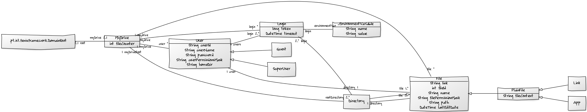

# *MYDRIVE*

The application MYDRIVE will maintain and manage a transactional file system. The system allows the creation and manipulation of various types of files: text, applications and links. Since this is a hierarchical file system, a directory is a file that may contain other files. The users of the application can interact with each other through shared files.

### Project Documentation
#### Project domain text
  * [EN](https://fenix.tecnico.ulisboa.pt/downloadFile/1970943312268883/es16p0en.pdf)
  * [PT-PT](https://fenix.tecnico.ulisboa.pt/downloadFile/1970943312268882/es16p0.pdf)
  
  1. **Assignment for the first release**
    * [EN](https://fenix.tecnico.ulisboa.pt/downloadFile/563568428731760/es16p1en.pdf)
    * [PT-PT](https://fenix.tecnico.ulisboa.pt/downloadFile/563568428731759/es16p1.pdf)
    
  2. **Assignment for the second release**
    * [EN](https://fenix.tecnico.ulisboa.pt/downloadFile/563568428736239/es16p2en.pdf)
    * [PT-PT](https://fenix.tecnico.ulisboa.pt/downloadFile/563568428736238/es16p2.pdf)
    
  3. **Assignment for the third release**
    * [EN](https://fenix.tecnico.ulisboa.pt/downloadFile/845043405447748/es16p3en.pdf)
    * [PT-PT](https://fenix.tecnico.ulisboa.pt/downloadFile/845043405447747/es16p3.pdf)
    
### UML

